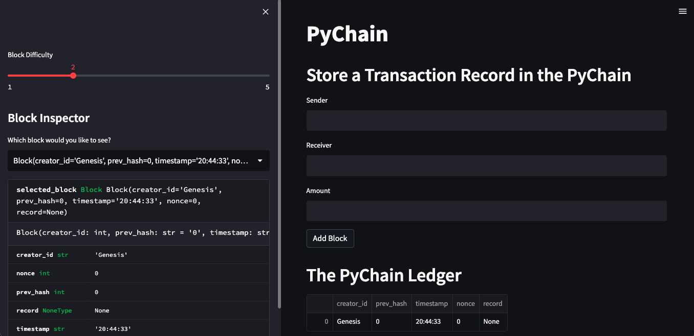
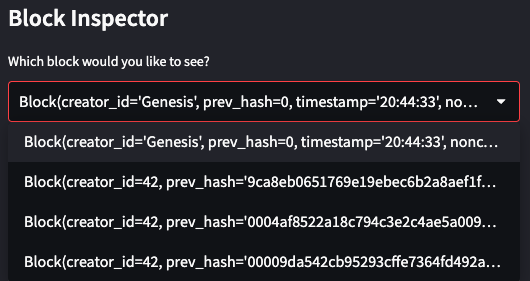
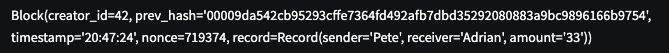
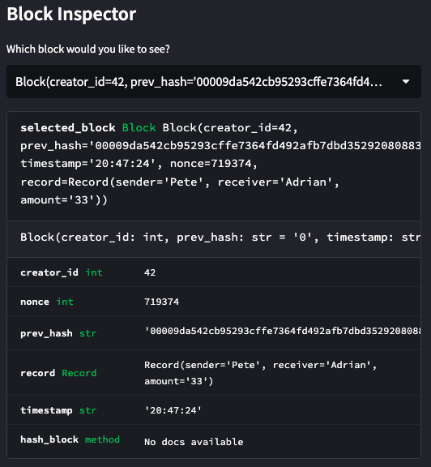
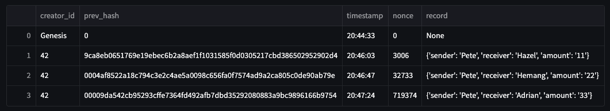
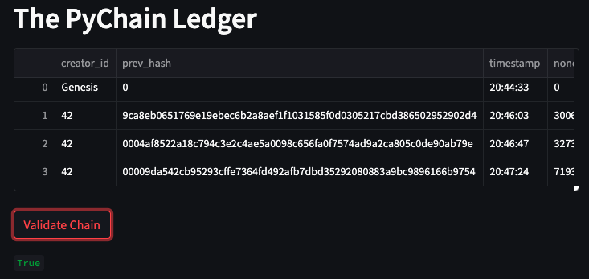
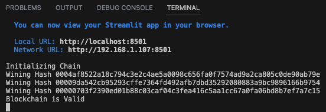

# PyChain Ledger
PyChain Ledger is a blockchain-based ledger system with a user-friendly web interface designed for financial transactions. It allows partner banks to securely conduct transactions and ensures the integrity of the stored data.

## Features
The PyChain Ledger offers the following features:

1. **Blockchain Ledger:** The ledger uses a blockchain structure to store financial transaction records securely. Each transaction record is stored as a block in the chain.

2. **Proof of Work:** The system employs a proof of work consensus protocol to ensure the integrity and security of the blockchain. This mechanism prevents malicious actors from tampering with the data.

3. **User-Friendly Interface:** PyChain provides a web-based user interface built with Streamlit, allowing partner banks to easily interact with the ledger system. Users can input transaction details, add blocks to the ledger, and validate the blockchain.

4. **Transaction Records:** The ledger stores transaction records consisting of sender, receiver, and amount information. Each block in the chain contains a record of a specific transaction.

## Technology Used
The project utilises the following technologies:

- `python`: the programming language used for implementing the blockchain logic.
- `streamlit`: a Python library for building interactive web applications.
- `pandas`: a data manipulation and analysis library used for displaying the PyChain ledger.
- `hashlib`: a Python library for hashing data.
- `datetime`: a Python library for working with dates and times.

## Usage
To use the PyChain Ledger:

1. Launch the Streamlit application by running streamlit run pychain.py in the terminal.
2. Enter the sender, receiver, and amount for a financial transaction in the respective input fields.
3. Click the "Add Block" button to add the transaction record as a new block in the PyChain ledger.
4. Repeat the process to add additional transaction records and blocks.
5. Click the "Validate Chain" button to verify the integrity of the blockchain.

## Demonstration
**Initial UI Display**

**Block Inspector Drowdown Menu**

**Highlighted Transaction In Dropdown Menu**

**Block Inspector Block Details**

**Expanded Table**

**Validate Chain**

**Terminal Output**

## Next Steps
Possible next steps to further enhance the PyChain Ledger:

1. **Transaction Verification:** Implement a transaction verification mechanism to ensure the authenticity and validity of each financial transaction recorded in the ledger. This can include digital signatures and validation checks.

2. **Smart Contracts:** Integrate smart contract functionality into the PyChain Ledger, allowing the execution of predefined business logic and automated transaction processing. This would enable the ledger to handle complex financial operations and agreements.

3. **Integration with External Systems:** Explore possibilities to integrate the PyChain Ledger with external systems and APIs, such as banking networks or identity verification services. This integration would enhance the interoperability and usefulness of the ledger in real-world financial ecosystems.

4. **Data Encryption and Privacy:** Implement data encryption techniques to ensure the privacy and confidentiality of sensitive information stored in the ledger. This is crucial for meeting regulatory requirements and protecting the financial data of participants.

## Summary
The PyChain Ledger provides a secure and efficient solution for partner banks to conduct financial transactions and maintain a trusted record of their operations. With its user-friendly interface, robust blockchain structure, and proof of work consensus protocol, the ledger ensures data integrity and enhances transparency in the financial ecosystem. By leveraging the power of decentralised technologies, PyChain is poised to revolutionise the way financial transactions are conducted and recorded.

I invite you to explore and contribute to the PyChain Ledger project, and join us in the journey to shape the future of decentralised finance.

